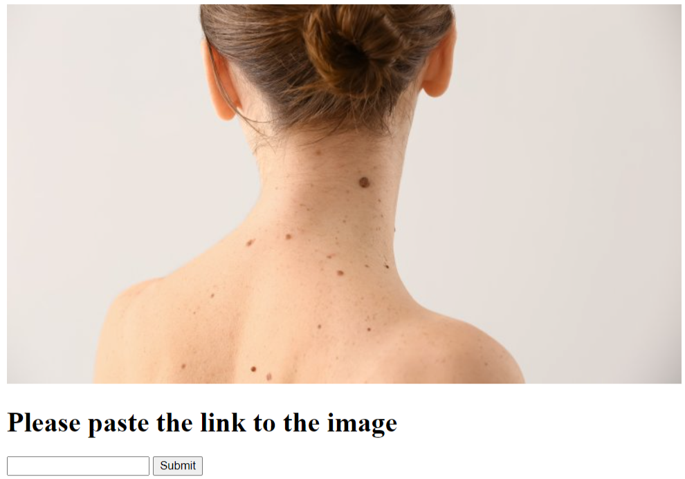

# Check My Diagnosis
____
***People think that the doctors are the smartest persons but we can make them even smarter !***
____
The app is a Flask application which was developed as a part of medical service that helps the medicals assess skin spots and moles for the most common types of skin cancer.

It can be used by executing HTTP requests with an image url to our Web API and checking HTTP response or through web API as shown below.

**Input**: images

**Architecture**: we used transfer learning with Mobilenet v2 neural network architecture combined with Dropout layer + Our classification layer

**Training**: we trained the model with ~7500 basic images and ~35 000 images generated by tensorflow image generator

**Output**: probabilities for each class of a mole for the input image

**Accuracy**: combined accuracy for 3 malignant classes ~97%; class accuracy ~67% 
